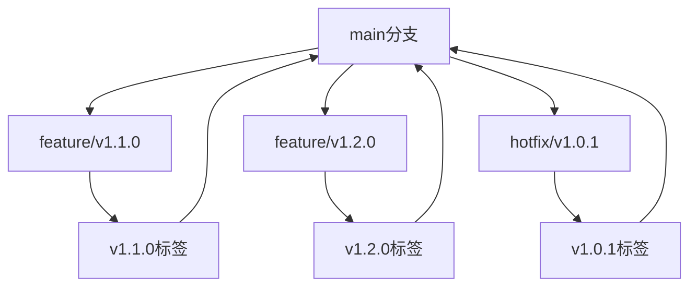

# 版本管理策略

## 版本命名规范

采用语义化版本控制 (Semantic Versioning): `MAJOR.MINOR.PATCH`

- **MAJOR**: 主要功能阶段 (1-5，对应学习计划的5个阶段)
- **MINOR**: 功能增加 (向后兼容的新功能)
- **PATCH**: 问题修复 (向后兼容的bug修复)

## 版本规划

### v1.x.x - 基础功能实现（单进程+内存数据源）
- **v1.0.0** ✅ 当前版本 - gRPC基础通讯 (SendTelemetry + GetTelemetry)
- **v1.1.0** 🔄 计划中 - 添加 SubscribeTelemetry (服务器流式推送)
- **v1.2.0** 🔄 计划中 - 添加 StreamTelemetry (双向流)
- **v1.3.0** 🔄 计划中 - 完善测试和文档

### v2.x.x - 引入Redis（支持多进程/多服务/持久化）
- **v2.0.0** 🔄 计划中 - 集成Redis基础功能
- **v2.1.0** 🔄 计划中 - 多进程数据一致性测试
- **v2.2.0** 🔄 计划中 - Redis性能优化

### v3.x.x - 容器化与Docker Compose
- **v3.0.0** 🔄 计划中 - Dockerfile和基础容器化
- **v3.1.0** 🔄 计划中 - Docker Compose多服务编排
- **v3.2.0** 🔄 计划中 - 容器网络和环境变量优化

### v4.x.x - 多进程/多服务/分布式部署
- **v4.0.0** 🔄 计划中 - 多进程服务支持
- **v4.1.0** 🔄 计划中 - 分布式部署和负载均衡
- **v4.2.0** 🔄 计划中 - 服务发现和健康检查

### v5.x.x - 高阶工程实践
- **v5.0.0** 🔄 计划中 - 认证鉴权系统
- **v5.1.0** 🔄 计划中 - 监控告警 (Prometheus + Grafana)
- **v5.2.0** 🔄 计划中 - CI/CD自动化
- **v5.3.0** 🔄 计划中 - 云原生部署 (K8s)

## 版本操作指南

### 1. 标记当前版本为 v1.0.0

```bash
# 添加所有更改
git add .

# 提交当前状态
git commit -m "feat: 完成gRPC基础通讯功能 - v1.0.0

- ✅ 实现SendTelemetry单向发送
- ✅ 实现GetTelemetry单向查询  
- ✅ 完成protobuf代码生成和导入修复
- ✅ 创建完整的测试脚本
- ✅ 编写详细的学习文档和运行指南
- ✅ 建立清晰的项目结构"

# 创建版本标签
git tag -a v1.0.0 -m "v1.0.0: gRPC基础通讯功能完成

核心功能:
- gRPC服务器和客户端通讯
- 内存存储的遥测数据管理
- 完整的测试和文档体系

技术栈:
- gRPC + Protobuf
- Python 3.x
- Buf工具链"

# 推送到远程仓库
git push origin main
git push origin v1.0.0
```

### 2. 创建新版本的工作流程

#### 开发新功能时：
```bash
# 创建功能分支
git checkout -b feature/v1.1.0-subscribe-telemetry

# 开发完成后
git add .
git commit -m "feat: 实现SubscribeTelemetry服务器流式推送功能"

# 合并到主分支
git checkout main
git merge feature/v1.1.0-subscribe-telemetry

# 创建新版本标签
git tag -a v1.1.0 -m "v1.1.0: 添加服务器流式推送功能"
git push origin main
git push origin v1.1.0
```

### 3. 版本回退和查看

```bash
# 查看所有版本
git tag --list

# 查看特定版本的详细信息
git show v1.0.0

# 切换到特定版本
git checkout v1.0.0

# 基于特定版本创建新分支
git checkout -b hotfix/v1.0.1 v1.0.0

# 回到最新版本
git checkout main
```

### 4. 版本比较

```bash
# 比较两个版本的差异
git diff v1.0.0 v1.1.0

# 查看版本间的提交历史
git log v1.0.0..v1.1.0 --oneline

# 查看特定文件在不同版本间的变化
git diff v1.0.0 v1.1.0 -- app/grpc_server.py
```

## 文件版本化策略

### 核心代码文件
- `app/grpc_server.py` - 服务器核心逻辑
- `app/grpc_client.py` - 客户端代码
- `generated/` - protobuf生成的代码
- `test/` - 测试代码

### 配置文件
- `buf.gen.yaml` - protobuf生成配置
- `buf.yaml` - buf工具配置
- `Makefile` - 构建脚本

### 文档文件
- `learningProgress.md` - 学习进度文档
- `新版-运行指南.md` - 运行指南
- `学习与实现_ToDo_List.md` - 任务清单
- `VERSION_MANAGEMENT.md` - 本文档

## 版本发布检查清单

### 发布前检查
- [ ] 所有测试通过
- [ ] 文档更新完成
- [ ] 运行指南验证
- [ ] 代码风格检查
- [ ] 性能测试通过

### 发布流程
1. 更新版本号相关文件
2. 更新 CHANGELOG.md
3. 提交所有更改
4. 创建版本标签
5. 推送到远程仓库
6. 创建 Release 说明

## 分支管理策略



### 分支命名规范
- `feature/vX.Y.Z-功能名` - 新功能开发
- `hotfix/vX.Y.Z` - 紧急修复
- `release/vX.Y.Z` - 发布准备分支

## 自动化脚本

### 版本标记脚本
```bash
#!/bin/bash
# scripts/tag_version.sh

VERSION=$1
MESSAGE=$2

if [ -z "$VERSION" ] || [ -z "$MESSAGE" ]; then
    echo "用法: ./tag_version.sh v1.1.0 '版本描述'"
    exit 1
fi

git add .
git commit -m "release: $VERSION - $MESSAGE"
git tag -a $VERSION -m "$VERSION: $MESSAGE"
git push origin main
git push origin $VERSION

echo "✅ 版本 $VERSION 已成功创建并推送"
```

### 版本查看脚本
```bash
#!/bin/bash
# scripts/show_versions.sh

echo "📋 所有版本列表:"
git tag --list --sort=-version:refname

echo -e "\n📊 版本统计:"
echo "总版本数: $(git tag --list | wc -l)"
echo "最新版本: $(git describe --tags --abbrev=0)"
echo "当前分支: $(git branch --show-current)"
```

## 下一步操作

立即执行以下命令来标记当前版本：

```bash
# 1. 提交当前状态
git add .
git commit -m "docs: 添加版本管理策略文档"

# 2. 创建v1.0.0标签
git tag -a v1.0.0 -m "v1.0.0: gRPC基础通讯功能完成"

# 3. 推送到远程
git push origin main
git push origin v1.0.0
```

这样您就完成了v1.0.0版本的标记，可以开始开发v1.1.0版本了！ 