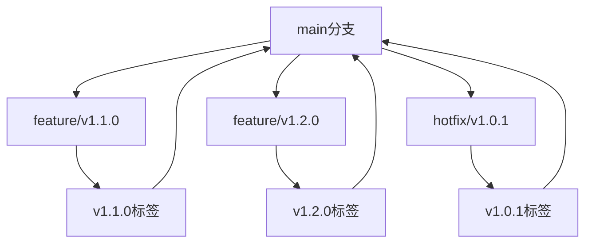

# 版本管理策略

## 版本命名规范

⚠️ **重要说明**: 由于本项目位于 `BackendSoftwareEngineerPrepare` 主仓库中，为避免版本标签冲突，我们采用**项目前缀**策略。

采用语义化版本控制 (Semantic Versioning): `grpc-MAJOR.MINOR.PATCH`

- **前缀**: `grpc-` (标识这是gRPC项目的版本)
- **MAJOR**: 主要功能阶段 (1-5，对应学习计划的5个阶段)
- **MINOR**: 功能增加 (向后兼容的新功能)
- **PATCH**: 问题修复 (向后兼容的bug修复)

### 版本标签示例
- `grpc-v1.0.0` - gRPC项目第1个主版本
- `grpc-v1.1.0` - 添加流式推送功能
- `grpc-v2.0.0` - 集成Redis功能

## 版本规划

### grpc-v1.x.x - 基础功能实现（单进程+内存数据源）
- **grpc-v1.0.0** ✅ 当前版本 - gRPC基础通讯 (SendTelemetry + GetTelemetry)
- **grpc-v1.1.0** 🔄 计划中 - 添加 SubscribeTelemetry (服务器流式推送)
- **grpc-v1.2.0** 🔄 计划中 - 添加 StreamTelemetry (双向流)
- **grpc-v1.3.0** 🔄 计划中 - 完善测试和文档

### grpc-v2.x.x - 引入Redis（支持多进程/多服务/持久化）
- **grpc-v2.0.0** 🔄 计划中 - 集成Redis基础功能
- **grpc-v2.1.0** 🔄 计划中 - 多进程数据一致性测试
- **grpc-v2.2.0** 🔄 计划中 - Redis性能优化

### grpc-v3.x.x - 容器化与Docker Compose
- **grpc-v3.0.0** 🔄 计划中 - Dockerfile和基础容器化
- **grpc-v3.1.0** 🔄 计划中 - Docker Compose多服务编排
- **grpc-v3.2.0** 🔄 计划中 - 容器网络和环境变量优化

### grpc-v4.x.x - 多进程/多服务/分布式部署
- **grpc-v4.0.0** 🔄 计划中 - 多进程服务支持
- **grpc-v4.1.0** 🔄 计划中 - 分布式部署和负载均衡
- **grpc-v4.2.0** 🔄 计划中 - 服务发现和健康检查

### grpc-v5.x.x - 高阶工程实践
- **grpc-v5.0.0** 🔄 计划中 - 认证鉴权系统
- **grpc-v5.1.0** 🔄 计划中 - 监控告警 (Prometheus + Grafana)
- **grpc-v5.2.0** 🔄 计划中 - CI/CD自动化
- **grpc-v5.3.0** 🔄 计划中 - 云原生部署 (K8s)

## 版本操作指南

### 1. 标记当前版本为 grpc-v1.0.0

```bash
# 添加所有更改
git add .

# 提交当前状态
git commit -m "feat: 完成gRPC基础通讯功能 - grpc-v1.0.0

- ✅ 实现SendTelemetry单向发送
- ✅ 实现GetTelemetry单向查询  
- ✅ 完成protobuf代码生成和导入修复
- ✅ 创建完整的测试脚本
- ✅ 编写详细的学习文档和运行指南
- ✅ 建立清晰的项目结构"

# 创建版本标签（使用grpc-前缀避免与主仓库冲突）
git tag -a grpc-v1.0.0 -m "grpc-v1.0.0: gRPC基础通讯功能完成

核心功能:
- gRPC服务器和客户端通讯
- 内存存储的遥测数据管理
- 完整的测试和文档体系

技术栈:
- gRPC + Protobuf
- Python 3.x
- Buf工具链"

# 推送到远程仓库
git push origin CI_CD_supportVersion  # 当前分支
git push origin grpc-v1.0.0
```

### 2. 创建新版本的工作流程

#### 开发新功能时：
```bash
# 创建功能分支
git checkout -b feature/v1.1.0-subscribe-telemetry

# 开发完成后
git add .
git commit -m "feat: 实现SubscribeTelemetry服务器流式推送功能"

# 合并到主分支
git checkout main
git merge feature/v1.1.0-subscribe-telemetry

# 创建新版本标签
git tag -a v1.1.0 -m "v1.1.0: 添加服务器流式推送功能"
git push origin main
git push origin v1.1.0
```

### 3. 版本回退和查看

```bash
# 查看所有版本
git tag --list

# 查看特定版本的详细信息
git show v1.0.0

# 切换到特定版本
git checkout v1.0.0

# 基于特定版本创建新分支
git checkout -b hotfix/v1.0.1 v1.0.0

# 回到最新版本
git checkout main
```

### 4. 版本比较

```bash
# 比较两个版本的差异
git diff v1.0.0 v1.1.0

# 查看版本间的提交历史
git log v1.0.0..v1.1.0 --oneline

# 查看特定文件在不同版本间的变化
git diff v1.0.0 v1.1.0 -- app/grpc_server.py
```

## 文件版本化策略

### 核心代码文件
- `app/grpc_server.py` - 服务器核心逻辑
- `app/grpc_client.py` - 客户端代码
- `generated/` - protobuf生成的代码
- `test/` - 测试代码

### 配置文件
- `buf.gen.yaml` - protobuf生成配置
- `buf.yaml` - buf工具配置
- `Makefile` - 构建脚本

### 文档文件
- `learningProgress.md` - 学习进度文档
- `新版-运行指南.md` - 运行指南
- `学习与实现_ToDo_List.md` - 任务清单
- `VERSION_MANAGEMENT.md` - 本文档

## 版本发布检查清单

### 发布前检查
- [ ] 所有测试通过
- [ ] 文档更新完成
- [ ] 运行指南验证
- [ ] 代码风格检查
- [ ] 性能测试通过

### 发布流程
1. 更新版本号相关文件
2. 更新 CHANGELOG.md
3. 提交所有更改
4. 创建版本标签
5. 推送到远程仓库
6. 创建 Release 说明

## 分支管理策略



### 分支命名规范
- `feature/vX.Y.Z-功能名` - 新功能开发
- `hotfix/vX.Y.Z` - 紧急修复
- `release/vX.Y.Z` - 发布准备分支

## 自动化脚本

### 版本标记脚本
```bash
#!/bin/bash
# scripts/tag_version.sh

VERSION=$1
MESSAGE=$2

if [ -z "$VERSION" ] || [ -z "$MESSAGE" ]; then
    echo "用法: ./tag_version.sh v1.1.0 '版本描述'"
    exit 1
fi

git add .
git commit -m "release: $VERSION - $MESSAGE"
git tag -a $VERSION -m "$VERSION: $MESSAGE"
git push origin main
git push origin $VERSION

echo "✅ 版本 $VERSION 已成功创建并推送"
```

### 版本查看脚本
```bash
#!/bin/bash
# scripts/show_versions.sh

echo "📋 所有版本列表:"
git tag --list --sort=-version:refname

echo -e "\n📊 版本统计:"
echo "总版本数: $(git tag --list | wc -l)"
echo "最新版本: $(git describe --tags --abbrev=0)"
echo "当前分支: $(git branch --show-current)"
```

## 实际操作记录

### grpc-v1.0.0 版本创建过程

**执行时间**: 2025-01-12 15:47:24

**实际执行的命令**:
```bash
# 1. 添加所有更改
git add .

# 2. 提交当前状态
git commit -m "feat: 完成gRPC基础通讯功能和版本管理策略 - grpc-v1.0.0

- ✅ 实现SendTelemetry单向发送
- ✅ 实现GetTelemetry单向查询  
- ✅ 完成protobuf代码生成和导入修复
- ✅ 创建完整的测试脚本
- ✅ 编写详细的学习文档和运行指南
- ✅ 建立清晰的项目结构
- ✅ 添加版本管理策略(使用grpc-前缀避免冲突)
- ✅ 创建自动化版本管理脚本"

# 3. 创建版本标签
git tag -a grpc-v1.0.0 -m "grpc-v1.0.0: gRPC基础通讯功能完成

核心功能:
- gRPC服务器和客户端通讯
- 内存存储的遥测数据管理
- 完整的测试和文档体系
- 版本管理策略(使用grpc-前缀避免冲突)

技术栈:
- gRPC + Protobuf
- Python 3.x
- Buf工具链"

# 4. 推送到远程仓库
git push origin grpc-v1.0.0
```

**执行结果**:
```
[CI_CD_supportVersion 6f4eff5] feat: 完成gRPC基础通讯功能和版本管理策略 - grpc-v1.0.0
To https://github.com/ws723514/BackendSoftwareEngineerPrepare.git
 * [new tag]         grpc-v1.0.0 -> grpc-v1.0.0
```

### 版本创建的意义

#### 1. **代码快照保存**
- 将当前完整的工作状态永久保存
- 包含所有文件、配置、文档的精确状态
- 形成一个"时间胶囊"，可以随时回到这个状态

#### 2. **里程碑标记**
- 标记重要功能的完成节点
- 为学习进度提供清晰的阶段划分
- 便于总结和回顾每个阶段的成果

#### 3. **风险管理**
- 在开发新功能前创建稳定版本
- 如果新开发出现问题，可以快速回退
- 避免因实验性代码破坏已有功能

#### 4. **协作和分享**
- 其他人可以精确复现您的工作环境
- 便于在不同设备间同步项目状态
- 为未来的自己提供参考基准

### 版本回退和恢复

#### 完全回退到 grpc-v1.0.0 版本

**方法1: 临时查看版本状态**
```bash
# 切换到版本状态（只读模式）
git checkout grpc-v1.0.0

# 查看当前状态
git log --oneline -5
git status

# 回到最新开发状态
git checkout CI_CD_supportVersion  # 或 main
```

**方法2: 创建基于版本的新分支**
```bash
# 基于grpc-v1.0.0创建新分支继续开发
git checkout -b feature/from-v1.0.0 grpc-v1.0.0

# 在新分支上继续开发
# 开发完成后可以合并回主分支
```

**方法3: 硬重置到版本状态（危险操作）**
```bash
# ⚠️ 警告：这会丢失所有未提交的更改
git reset --hard grpc-v1.0.0

# 如果需要同步到远程（强制推送）
git push origin CI_CD_supportVersion --force
```

#### 恢复特定文件到版本状态

```bash
# 只恢复特定文件到grpc-v1.0.0状态
git checkout grpc-v1.0.0 -- app/grpc_server.py
git checkout grpc-v1.0.0 -- app/grpc_client.py

# 查看恢复的文件
git status
git diff
```

#### 比较当前状态与版本差异

```bash
# 查看当前代码与grpc-v1.0.0的差异
git diff grpc-v1.0.0

# 查看特定文件的差异
git diff grpc-v1.0.0 -- app/grpc_server.py

# 查看文件变更统计
git diff --stat grpc-v1.0.0
```

### 版本验证和测试

#### 验证版本完整性
```bash
# 切换到版本
git checkout grpc-v1.0.0

# 验证项目结构
ls -la
ls app/
ls test/

# 运行测试验证功能
cd RealTimeDataMonitorDemoRewritebyHand
python -m test.test_communication

# 手动测试gRPC通讯
# 终端1: python -m test.server
# 终端2: python -m app.grpc_client
```

#### 环境重现
```bash
# 如果使用虚拟环境
python -m venv venv-grpc-v1.0.0
source venv-grpc-v1.0.0/bin/activate  # Linux/Mac
# 或 venv-grpc-v1.0.0\Scripts\activate  # Windows

# 安装依赖
pip install grpcio grpcio-tools protobuf

# 重新生成protobuf代码（如果需要）
buf generate
```

### 实际应用场景

#### 场景1: 开发新功能前的备份
```bash
# 开发grpc-v1.1.0前，确保v1.0.0状态稳定
git tag -a grpc-v1.0.0 -m "稳定版本备份"
git push origin grpc-v1.0.0

# 开始新功能开发
git checkout -b feature/v1.1.0-subscribe
# 开发 SubscribeTelemetry 功能...
```

#### 场景2: 功能开发失败，需要回退
```bash
# 如果v1.1.0开发遇到问题
git checkout grpc-v1.0.0
git checkout -b hotfix/v1.0.1-from-stable

# 基于稳定版本进行小修复
# 修复完成后创建新版本
```

#### 场景3: 演示和教学
```bash
# 向他人展示项目的特定阶段
git checkout grpc-v1.0.0
# 此时项目处于基础通讯功能完成状态
# 可以演示SendTelemetry和GetTelemetry功能

# 展示完毕后回到开发状态
git checkout CI_CD_supportVersion
```

### 版本管理最佳实践

1. **定期创建版本**: 每完成一个重要功能就创建版本
2. **版本信息详细**: 标签信息要包含功能描述和技术细节
3. **测试后标记**: 确保功能测试通过后再创建版本
4. **文档同步**: 版本标记时同步更新文档和变更日志
5. **分支保护**: 重要版本可以创建保护分支避免误操作

### 下一步操作建议

现在您已经有了稳定的 grpc-v1.0.0 版本，可以：

1. **继续开发**: 在当前分支开发 grpc-v1.1.0 功能
2. **创建实验分支**: 基于 v1.0.0 尝试不同的实现方案
3. **环境复现**: 在其他机器上精确复现当前项目状态
4. **学习回顾**: 随时回到 v1.0.0 查看基础实现

通过版本管理，您的项目现在具备了专业级的代码管理能力！ 