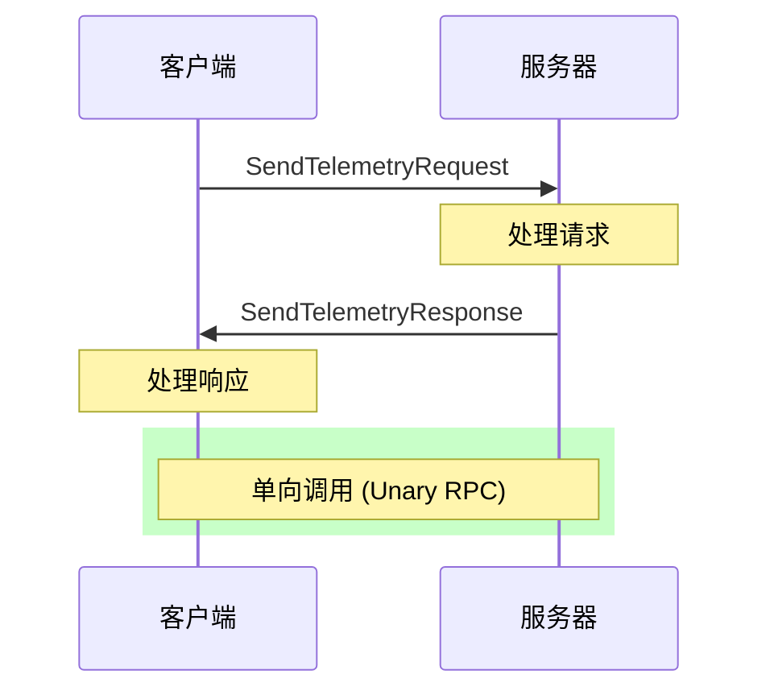
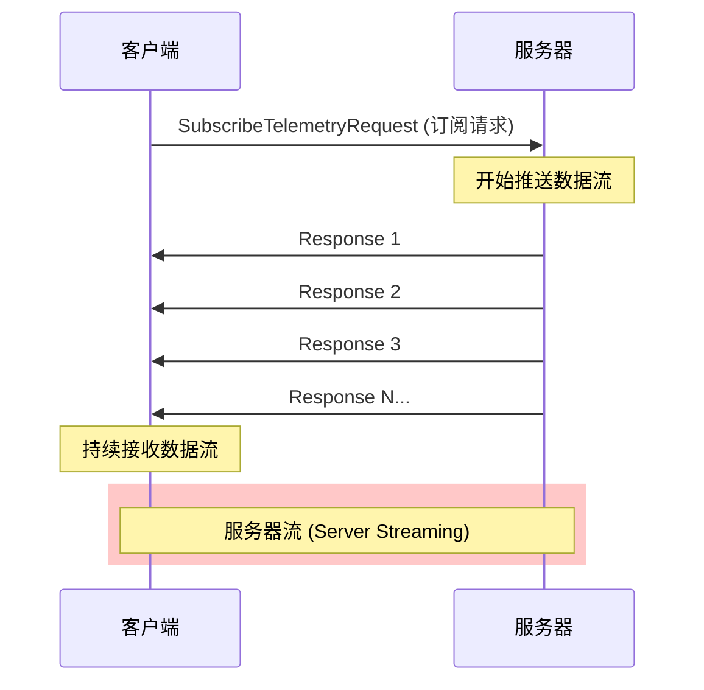
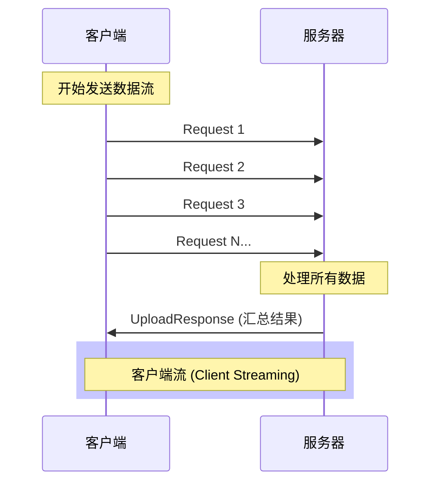
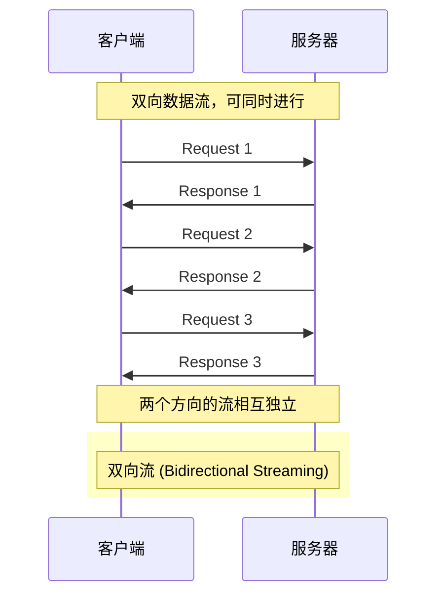
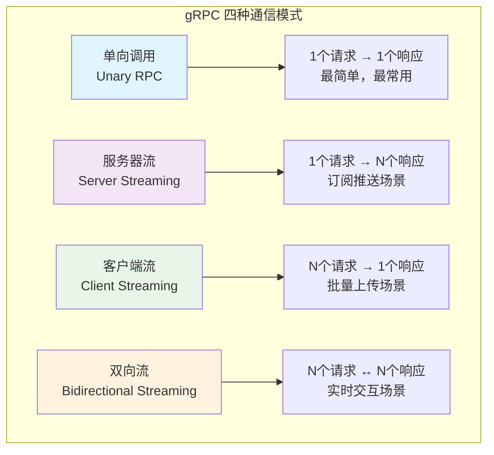
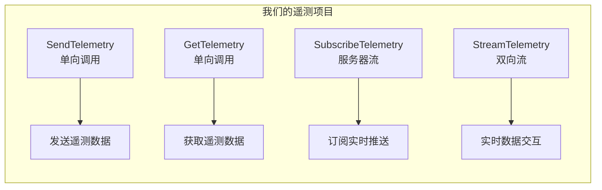
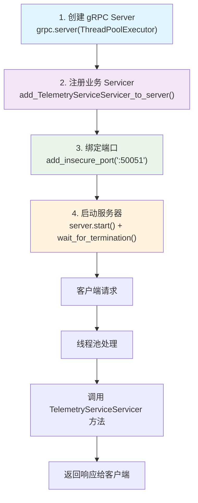
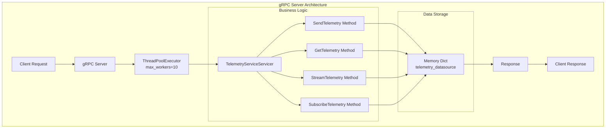
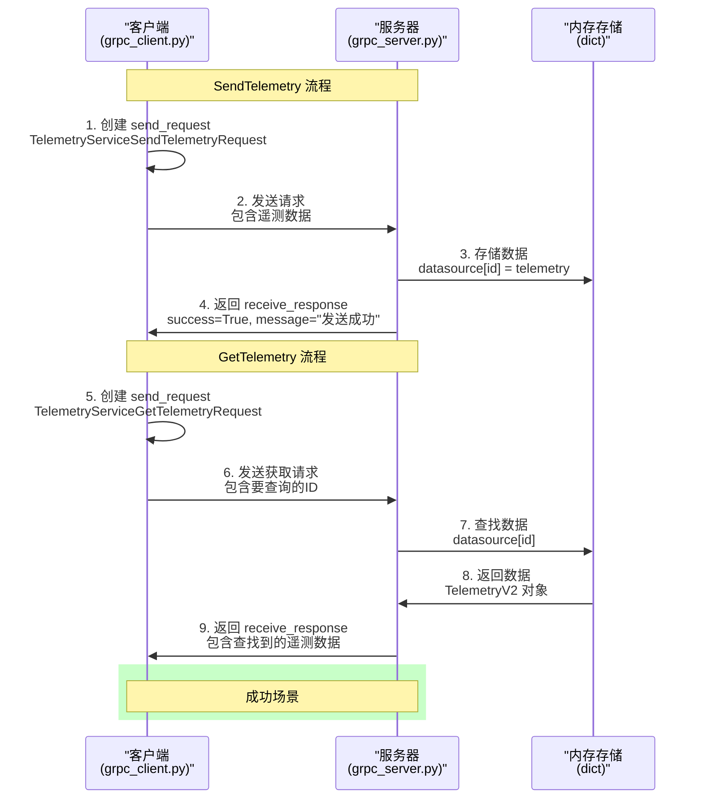
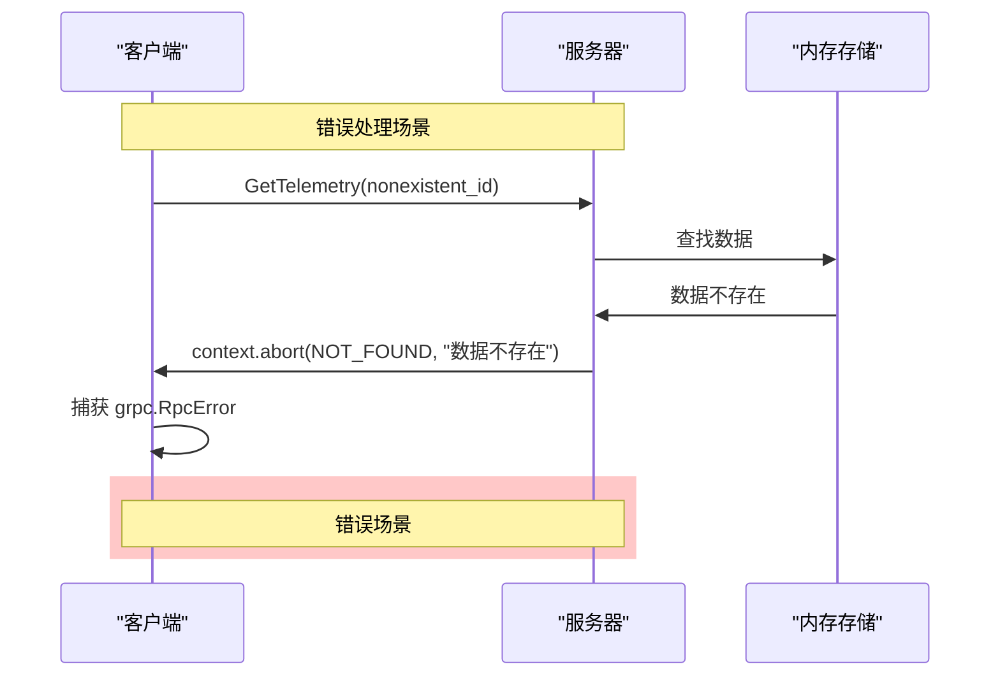

# gRPC + Protobuf 学习进度

## 1. 基础概念

需要使用gRPC来进行网络协议规定，支持双向流

使用protobuf来进行数据传输 他是二进制序列化格式，gRPC的数据载体

### 1a. 细节知识点：

- **gRPC 与 Protobuf 的关系**
    - gRPC = 传输协议 + 通讯框架
    - Protobuf = 数据描述语言 + 序列化格式
    - 两者解耦，但在官方实现中"强绑定"为默认组合。

- **Proto3 的"字段默认值"**
    - 字符串默认 ""
    - 数字默认 0
    - 布尔默认 false
    - 因为没有 has_xxx() 方法，所以客户端若要区分"未赋值"与"空字符串"，需要加 google.protobuf.* 的 Wrapper 类型。

- **字段编号设计建议**
    - 1～15 采用变长编码，一个字节；16 以上至少两个字节。
    - 频繁出现的字段放前面，可节省字节数。
    - 预留跳号（10、20…），方便以后插空，避免重排导致的兼容性风险。

- **双向流适用场景**
    - 聊天室实时消息
    - IoT 设备与服务器持续心跳 + 下行指令
    - 在线游戏实时同步

### 1b. 实现步骤

这里我们需要建立proto文件夹和***.proto文件
通常我们使用telemetry.proto 和sensor.proto作为文件名

编写规则，需要下载 vscode-proto3 和protobuf 两个extension 
然后一路tab 智能会帮助你写出最基本的模块。也可以参考我的文件。

可能存在的问题，无法自动补全。 

#### 1c.1. 文件类型没有指定
在vs code下面选择proto buff 或者proto3 

#### 1c.2. 去设置搜索proto3. 在jason文件中添加choco的include path
- 2a. 你需要一个choco包管理器 记得下载
- 2b. 我安装在F盘，如果不知道这个文件在哪，可以使用这条命令寻找
```powershell
dir "你的choco root path" -Recurse -Filter descriptor.proto | select -First 1
```

结果：
```json
// Protocol Buffer 插件 – 指向 protoc.exe
"proto3.protoc": "your root path of choco...\\choco\\bin\\protoc.exe",

// 工作区自有 proto 目录 + 标准 include 目录
"proto3.includeDir": [
    "${workspaceFolder}/proto",
    "your root path of choco...\\choco\\lib\\protoc\\tools\\include"
]
```

### 1d. 使用buf来进行管理 

#### 文件组织方式对比：

**原项目 (RealTimeDataMonitorDemo)：**
```
app/
├── main.py
├── ingest.py  
├── telemetry_pb2.py      ← 直接放在 app/ 目录
├── telemetry_pb2_grpc.py ← 直接放在 app/ 目录
└── pipeline.py
```

**新项目 (RealTimeDataMonitorDemoRewritebyHand)：**
```
generated/
└── telemetry/
    └── v1/
        ├── telemetry_pb2.py      ← 按包名组织
        └── telemetry_pb2_grpc.py ← 按包名组织
```

#### 为什么要改变文件组织方式？

1. **遵循最佳实践**
    - 原项目: 手动管理，文件直接放在 app/ 目录
    - 新项目: 使用 Buf 工具，按照 protobuf 包名自动组织

2. **包名与目录结构对应**
    ```
    package telemetry.v1;  →  generated/telemetry/v1/
    ```

3. **版本管理**
    - 原项目: 没有版本概念，升级时需要手动处理
    - 新项目: 支持多版本并存：
        ```
        generated/
        ├── telemetry/v1/  ← 版本 1
        └── telemetry/v2/  ← 版本 2（将来）
        ```

4. **依赖管理**
    - 原项目: 手动复制文件，容易出错
    - 新项目: 通过 buf.gen.yaml 自动生成，保持同步

#### 代码中的导入方式：

**原项目导入方式:**
```python
from telemetry_pb2 import TelemetryData
from telemetry_pb2_grpc import TelemetryServiceStub
```

**新项目导入方式:**
```python
from generated.telemetry.v1.telemetry_pb2 import TelemetryV2
from generated.telemetry.v1.telemetry_pb2_grpc import TelemetryServiceStub
```

#### 如需保持简单结构，可修改 buf.gen.yaml：
```yaml
version: v1
plugins:
  - plugin: buf.build/protocolbuffers/python
    out: app  # 直接输出到 app 目录
  - plugin: buf.build/grpc/python
    out: app  # 直接输出到 app 目录
```

**总结：** 新的组织方式更规范，适合大型项目；原来的方式更简单，适合学习和小项目。

## 2. 工程流程
### 一、先跑通纯 gRPC
#### 1. 在 app/ 下创建
        grpc_server.py → 继承 TelemetryServiceServicer，暂时只实现 SendTelemetry，把收到的数据 print() 出来即可。
      在 app/ 下创建
        grpc_client.py → 生成一条 TelemetryV2，调用 SendTelemetry，确认服务器打印成功。
      先 python app/grpc_server.py，再 python app/grpc_client.py。
      若能看到「收到数据 id=…」即表明 gRPC 通路无误。

### 二、接入 FastAPI-Redis 流水线
#### 1. FastAPI 负责收 HTTP 请求 → 在路由里调用 gRPC 客户端，把参数转成 TelemetryV2。
      gRPC 服务器中把收到的数据写入 Redis（可复用旧项目里的 pipeline.py）。
      用 Postman 打 HTTP → FastAPI → gRPC → Redis，检查 Redis 是否新增键值。
### 三、完善环境与交付
#### 1. 把 gRPC 服务写进 docker-compose.yml，端口 50051；FastAPI 容器改用服务名调用。
      Makefile 再加两个目标
        run_server : python app/grpc_server.py
        run_client : python app/grpc_client.py
      在《运行指南.md》追加
        如何一键 make proto、make run_server
        如何通过 HTTP 触发完整链路
      在 tests/ 里写最小 e2e：
        pytest tests/test_grpc.py → 直接用 gRPC stub 调服务器，看返回 success==True。
  这样就能形成：
    HTTP ⇄ FastAPI ⇄ gRPC ⇄ Redis
    本地 & Docker 均可一键跑通。


## 附录：RPC 包装消息 vs 直接使用核心消息

• PoC / Demo / 同仓库脚本  
  - 做法：直接把 TelemetryV2 当作 RPC 参数与返回  
  - 优点：写得快，代码量少  
  - 缺点：后续想扩展字段必须改动旧消息，可能破坏兼容  

• 生产接口 / 对外 SDK / 需长期演进  
  - 做法：为每个 RPC 定义 XxxRequest / XxxResponse，里面嵌 TelemetryV2  
  - 优点：易扩展，语义清晰，符合 Google & Buf Lint 规范  
  - 缺点：写的文件多，看起来啰嗦

### 实际示例

```proto
// —— 生产写法 ——
message SendTelemetryRequest {
  TelemetryV2 telemetry = 1;
  string client_id      = 2; // 新增字段示例
  int32  priority       = 3; // 新增字段示例
}

message SendTelemetryResponse {
  bool   success  = 1;
  string message  = 2;
}

service TelemetryService {
  rpc SendTelemetry(SendTelemetryRequest) returns (SendTelemetryResponse);
}
```

如果以后需要幂等键，只需：
```proto
message SendTelemetryRequest {
  TelemetryV2 telemetry = 1;
  string client_id      = 2;
  int32  priority       = 3;
  string idempotency_key = 4; // 新增，不影响旧客户端
}
```

### 关键点
1. **编号只增不改**：新增字段用 4、5、6…，不要复用旧编号。
2. **向后兼容**：旧客户端忽略未识别字段，依然可用。
3. **只在必要时动核心消息**：TelemetryV2 真要扩充才改；否则首选在 Request / Response 外层加字段。


## 3. gRPC 四种 RPC 模式详解

### 3.1 模式概览

gRPC 提供四种不同的 RPC 调用模式，每种模式适用于不同的业务场景：

### 3.2 四种模式详细说明

#### 1. 单向调用（Unary RPC）
```protobuf
rpc SendTelemetry(SendTelemetryRequestMessage) returns (SendTelemetryResponseMessage);
```

**原型**：客户端发送一个请求，服务器返回一个响应

**特点**：
- 最简单的 RPC 模式，类似普通函数调用
- 阻塞调用，客户端等待服务器响应
- 一对一的请求-响应模式

**客户端代码示例**：
```python
# 客户端代码
request = SendTelemetryRequestMessage(telemetry=data)
response = stub.SendTelemetry(request)  # 阻塞调用，等待响应
print(response.success)
```

**时序图**：


**应用场景**：
- 用户登录验证
- 数据查询操作
- 配置更新请求

#### 2. 服务器流（Server Streaming）
```protobuf
rpc SubscribeTelemetry(SubscribeTelemetryRequestMessage) returns (stream SubscribeTelemetryResponseMessage);
```

**原型**：客户端发送一个请求，服务器返回多个响应（流）

**特点**：
- 客户端发送一次订阅请求
- 服务器持续推送数据流
- 适用于订阅推送场景

**客户端代码示例**：
```python
# 客户端代码
request = SubscribeTelemetryRequestMessage(filter="type=SYSTEM")
response_stream = stub.SubscribeTelemetry(request)
for response in response_stream:  # 持续接收服务器推送
    print(f"收到数据: {response.telemetry}")
```

**时序图**：


**应用场景**：
- 股票价格实时推送
- 系统监控数据订阅
- 新闻推送服务
- 日志实时查看

#### 3. 客户端流（Client Streaming）
```protobuf
rpc UploadTelemetry(stream UploadRequestMessage) returns (UploadResponseMessage);
```

**原型**：客户端发送多个请求（流），服务器返回一个响应

**特点**：
- 客户端持续发送数据流
- 服务器处理完所有数据后返回一个汇总响应
- 适用于批量上传场景

**客户端代码示例**：
```python
# 客户端代码
def generate_requests():
    for i in range(10):
        yield UploadRequestMessage(data=f"batch_{i}")

response = stub.UploadTelemetry(generate_requests())
print(response.total_received)
```

**时序图**：


**应用场景**：
- 文件批量上传
- 日志批量提交
- 数据批量导入
- 传感器数据批量收集

#### 4. 双向流（Bidirectional Streaming）
```protobuf
rpc StreamTelemetry(stream StreamTelemetryRequestMessage) returns (stream StreamTelemetryResponseMessage);
```

**原型**：客户端和服务器都可以发送多个消息（双向流）

**特点**：
- 客户端和服务器可以同时发送数据流
- 两个方向的数据流相互独立
- 适用于实时交互场景

**客户端代码示例**：
```python
# 客户端代码
def generate_requests():
    for i in range(10):
        yield StreamTelemetryRequestMessage(telemetry=data)

response_stream = stub.StreamTelemetry(generate_requests())
for response in response_stream:
    print(f"实时响应: {response.telemetry}")
```

**时序图**：


**应用场景**：
- 实时聊天系统
- 在线游戏数据同步
- IoT 设备双向通信
- 实时协作编辑

### 3.3 关键区别总结

#### 括号中的内容区别：
- **无 `stream`**：单个消息
- **有 `stream`**：消息流（可以发送/接收多个）

#### 项目中的设计应用：

```protobuf
service TelemetryService {
    // 单向：发送数据
    rpc SendTelemetry(SendTelemetryRequestMessage) returns (SendTelemetryResponseMessage);           
    
    // 单向：获取数据
    rpc GetTelemetry(GetTelemetryRequestMessage) returns (GetTelemetryResponseMessage);              
    
    // 双向流：实时交互
    rpc StreamTelemetry(stream StreamTelemetryRequestMessage) returns (stream StreamTelemetryResponseMessage);  
    
    // 服务器流：订阅推送
    rpc SubscribeTelemetry(SubscribeTelemetryRequestMessage) returns (stream SubscribeTelemetryResponseMessage); 
}
```

### 3.4 四种模式对比图



### 3.5 选择指南

| 模式 | 请求数量 | 响应数量 | 使用场景 | 优势 | 注意事项 |
|------|----------|----------|----------|------|----------|
| 单向调用 | 1 | 1 | 简单请求-响应 | 简单、可靠 | 不适合大量数据 |
| 服务器流 | 1 | N | 订阅推送 | 实时性好 | 需要处理连接断开 |
| 客户端流 | N | 1 | 批量上传 | 高效传输 | 需要处理背压 |
| 双向流  | N | N | 实时交互 | 最大灵活性 | 复杂度最高 |

**实际项目中的应用示例：**



这样的设计覆盖了所有常见的数据交互模式，为不同业务场景提供了最适合的通信方式！

## 3. 本地 gRPC 通讯实现与测试

### 3.1 实现目标

通过手写实现完整的 gRPC 客户端-服务器通讯，深入理解：
- gRPC 服务器启动流程
- 客户端请求-响应机制
- protobuf 数据序列化
- 错误处理机制

### 3.2 项目架构

```
RealTimeDataMonitorDemoRewritebyHand/
├── app/
│   ├── __init__.py              # Python 包标识
│   ├── grpc_server.py           # 服务器业务逻辑实现
│   └── grpc_client.py           # 客户端实现
├── test/
│   ├── __init__.py              # Python 包标识
│   └── server.py                # 服务器启动脚本
├── generated/
│   └── telemetry/v1/
│       ├── __init__.py          # Python 包标识
│       ├── telemetry_pb2.py     # 生成的 protobuf 消息类
│       └── telemetry_pb2_grpc.py # 生成的 gRPC 服务类
└── 新版-运行指南.md             # 详细运行指南
```

### 3.3 核心实现

#### 3.3.1 服务器实现（app/grpc_server.py）

**关键学习点：**
1. **继承 gRPC 生成的 Servicer 基类**
2. **实现业务逻辑方法**
3. **数据存储与检索**
4. **错误处理机制**

```python
class TelemetryServiceServicer(telemetry_pb2_grpc.TelemetryServiceServicer):
    def __init__(self):
        # 使用字典作为内存数据源，键=id，值=TelemetryV2
        self.telemetry_datasource: dict[str, telemetry_pb2.TelemetryV2] = {}

    def SendTelemetry(self, request, context):
        # 存储遥测数据
        self.telemetry_datasource[request.telemetry.id] = request.telemetry
        return telemetry_pb2.TelemetryServiceSendTelemetryResponse(
            success=True,
            message=f"{request.client_id} 遥测数据发送成功"
        )
        
    def GetTelemetry(self, request, context):
        # 检索遥测数据
        if request.id in self.telemetry_datasource:
            return telemetry_pb2.TelemetryServiceGetTelemetryResponse(
                telemetry=self.telemetry_datasource[request.id]
            )
        # 错误处理：数据不存在
        context.abort(grpc.StatusCode.NOT_FOUND, f"遥测数据 {request.id} 不存在")
```

#### 3.3.2 客户端实现（app/grpc_client.py）

**关键学习点：**
1. **变量命名规范**：`send_request` vs `receive_response`
2. **protobuf 数据类型使用**
3. **gRPC 连接管理**

**变量命名改进过程：**
```python
# 原始代码 - 注释原因：变量名'request'不够明确
# request = telemetry_pb2.TelemetryServiceSendTelemetryRequest(...)
# response = self.stub.SendTelemetry(request)

# 新代码 - 改进：使用更清晰的变量名
send_request = telemetry_pb2.TelemetryServiceSendTelemetryRequest(...)
receive_response = self.stub.SendTelemetry(send_request)
```

**protobuf 类型修复：**
```python
# 原始代码 - 注释原因：protobuf类型使用错误
# demo_data = telemetry_pb2.TelemetryV2(
#     id = "1",
#     type = telemetry_pb2.TelemetryType.SYSTEM,  # 错误：不存在的类型
#     content = "test"  # 错误：应该是Any类型
# )

# 新代码 - 改进：使用正确的protobuf类型
content_any = any_pb2.Any()
content_string = wrappers_pb2.StringValue(value="客户端测试数据")
content_any.Pack(content_string)

demo_data = telemetry_pb2.TelemetryV2(
    id = "client_test_001",
    type = telemetry_pb2.DataType.DATA_TYPE_SYSTEM,  # 正确的枚举类型
    content = content_any  # 正确的Any类型
)
```

#### 3.3.3 服务器启动脚本（test/server.py）

**gRPC 服务器启动的四个核心步骤流程图：**



**详细步骤解析：**

```python
def serve() -> None:
    # 步骤1: 创建服务器 - 为什么要学习？
    server = grpc.server(futures.ThreadPoolExecutor(max_workers=10))
    # 学习价值: 理解并发处理机制
    # 关键点: max_workers=10 意味着最多同时处理10个请求

    # 步骤2: 注册服务 - 为什么要学习？
    telemetry_pb2_grpc.add_TelemetryServiceServicer_to_server(
        TelemetryServiceServicer(), server
    )
    # 学习价值: 理解业务逻辑如何与gRPC框架连接
    # 关键点: TelemetryServiceServicer() 是你的业务实现类

    # 步骤3: 绑定端口 - 为什么要学习？
    server.add_insecure_port("[::]:50051")
    # 学习价值: 理解网络配置
    # 关键点: [::]:50051 同时支持IPv4和IPv6

    # 步骤4: 启动服务 - 为什么要学习？
    server.start()
    print("[gRPC] Server started on 0.0.0.0:50051 (insecure)")
    server.wait_for_termination()
    # 学习价值: 理解服务器生命周期
    # 关键点: wait_for_termination() 让服务器持续运行
```

**服务器架构图：**



### 3.4 运行方式

#### 3.4.1 手动分离测试（推荐学习）

**步骤1：启动服务器**
```bash
python -m test.server
```

**步骤2：运行客户端**
```bash
python -m app.grpc_client
```

#### 3.4.2 一键集成测试
```bash
python test_communication.py  # 自动启动服务器和客户端
```

### 3.5 测试结果分析

#### 3.5.1 成功的通讯流程

```
🚀 启动 gRPC 客户端测试...
📤 准备发送遥测数据: ID=client_test_001
   发送请求内容: 类型=1, 内容=type_url: "type.googleapis.com/google.protobuf.StringValue"
   🔄 正在发送请求...
✅ 接收到服务器响应: client_1 遥测数据发送成功
   响应状态: success=True
📥 发送获取请求: ID=client_test_001
   🔄 正在发送获取请求...
✅ 接收到服务器响应数据: ID=client_test_001
   接收到的内容: type_url: "type.googleapis.com/google.protobuf.StringValue"
🎉 客户端测试完成！
```

#### 3.5.2 数据流向分析

**完整的请求-响应流程图：**



**错误处理流程图：**



**数据类型转换流程：**

```mermaid
flowchart LR
    A[Python 字符串<br/>"客户端测试数据"] --> B[wrappers_pb2.StringValue<br/>protobuf 包装]
    B --> C[any_pb2.Any<br/>通用容器]
    C --> D[TelemetryV2.content<br/>存储在遥测数据中]
    D --> E[网络传输<br/>二进制序列化]
    E --> F[服务器接收<br/>自动反序列化]
    F --> G[存储到内存<br/>dict[id] = TelemetryV2]
    G --> H[客户端获取<br/>完整数据返回]
```

### 3.6 关键学习收获

#### 3.6.1 变量命名规范
- **`send_request`**：客户端创建并发送的请求
- **`receive_response`**：客户端接收到的服务器响应
- **避免使用**：模糊的 `request`、`response` 变量名

#### 3.6.2 protobuf 数据类型
- **枚举类型**：`DataType.DATA_TYPE_SYSTEM`（不是 `TelemetryType.SYSTEM`）
- **Any 类型**：需要使用 `google.protobuf.Any` 和 `Pack()` 方法
- **字符串包装**：使用 `wrappers_pb2.StringValue` 包装字符串

#### 3.6.3 错误处理机制
- **连接错误**：`StatusCode.UNAVAILABLE` - 服务器未启动
- **数据不存在**：`StatusCode.NOT_FOUND` - 自定义业务错误
- **使用 `context.abort()`** 返回标准 gRPC 错误

#### 3.6.4 Python 包管理
- **必须添加 `__init__.py`** 文件使目录成为 Python 包
- **使用模块方式运行**：`python -m app.grpc_client`
- **导入路径**：`from generated.telemetry.v1 import telemetry_pb2`

### 3.7 故障排除经验

#### 3.7.1 常见错误及解决方案

| 错误类型 | 错误信息 | 解决方案 |
|----------|----------|----------|
| 模块导入错误 | `ModuleNotFoundError: No module named 'generated'` | 添加 `__init__.py` 文件，使用 `python -m` 运行 |
| 连接被拒绝 | `Connection refused (10061)` | 先启动服务器，再运行客户端 |
| protobuf 类型错误 | `AttributeError: 'TelemetryType'` | 使用正确的枚举类型 `DataType` |
| 端口占用 | `StatusCode.UNAVAILABLE` | 检查端口 50051 是否被占用 |

#### 3.7.2 调试技巧
1. **分步测试**：先测试 protobuf 导入，再测试 gRPC 连接
2. **日志输出**：添加详细的请求-响应日志
3. **错误捕获**：使用 try-except 捕获和分析错误
4. **网络检查**：确认服务器端口绑定成功

### 3.8 下一步扩展

#### 3.8.1 功能扩展
- [ ] 实现流式方法（`StreamTelemetry`、`SubscribeTelemetry`）
- [ ] 添加更多数据类型测试
- [ ] 实现数据持久化（Redis/数据库）
- [ ] 添加认证和授权机制

#### 3.8.2 性能优化
- [ ] 调整线程池大小
- [ ] 实现连接池管理
- [ ] 添加负载均衡
- [ ] 实现优雅关闭

#### 3.8.3 生产环境准备
- [ ] 添加 TLS 加密
- [ ] 实现健康检查
- [ ] 添加监控和日志
- [ ] Docker 容器化部署

通过这个完整的本地通讯实现，我们深入理解了 gRPC 的工作原理，掌握了客户端-服务器通讯的核心技术，为后续的复杂功能开发打下了坚实基础。


